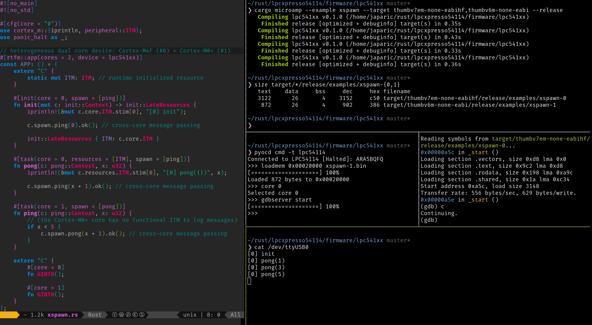

# `lpcxpresso54114`

> [Prototype] Real Time for The Masses on the heterogeneous dual core LPC54114J256BD64 (M4F + M0+)



Single source, dual-core Real Time For the Masses application demoing cross-core message passing

## Requirements

- `arm-none-eabi-strip`, install with `pacman -S arm-none-eabi-binutils` or similar

- `cargo-microamp`, install with `cargo install microamp-tools --version 0.1.0-alpha.2`

- `rustup default nightly`

- `rustup target add thumbv6m-none-eabi thumbv7em-none-eabihf`

## How to build the examples

``` console
$ cd firmware/lpc541xx

$ cargo microamp --example xspawn --target thumbv7em-none-eabihf,thumbv6m-none-eabi --release -v
"cargo" "rustc" "--example" "xspawn" "--release" "--target" "thumbv7em-none-eabihf" "--" \
  "-C" "lto" "--cfg" "microamp" "--emit=obj" "-A" "warnings" "-C" "linker=microamp-true"

"arm-none-eabi-strip" "-R" "*" "-R" "!.shared" "--strip-unneeded" "/tmp/cargo-microamp.KLZcpEjC6oU2/microamp-data.o"

"cargo" "rustc" "--example" "xspawn" "--release" "--target" "thumbv7em-none-eabihf" "--" \
  "--cfg" "core=\"0\"" "-C" "link-arg=-Tcore0.x" "-C" "link-arg=/tmp/cargo-microamp.KLZcpEjC6oU2/microamp-data.o"

"cargo" "rustc" "--example" "xspawn" "--release" "--target" "thumbv6m-none-eabi" "--" \
  "-C" "lto" "--cfg" "microamp" "--emit=obj" "-A" "warnings" "-C" "linker=microamp-true"

"arm-none-eabi-strip" "-R" "*" "-R" "!.shared" "--strip-unneeded" "/tmp/cargo-microamp.8WM0WkmcEAWW/microamp-data.o"

"cargo" "rustc" "--example" "xspawn" "--release" "--target" "thumbv6m-none-eabi" "--" \
  "--cfg" "core=\"1\"" "-C" "link-arg=-Tcore1.x" "-C" "link-arg=/tmp/cargo-microamp.8WM0WkmcEAWW/microamp-data.o"
```

This produces *two* ELF images.

``` console
$ size -Ax target/*/release/examples/xspawn-{0,1}
target/thumbv7em-none-eabihf/release/examples/xspawn-0  :
section              size         addr
.vectors             0xd8          0x0
.text               0x9d0         0xd8
.rodata             0x198        0xaa8
.bss                  0x4   0x20000000
.data                 0x0   0x20000004
.shared              0x1a   0x20020000
(..)
Total             0x1c453

target/thumbv6m-none-eabi/release/examples/xspawn-1  :
section              size         addr
.vectors             0xc0      0x20000
.text               0x2a2      0x200c0
.rodata               0x0      0x20364
.bss                  0x4   0x20010000
.data                 0x0   0x20010004
.shared              0x1a   0x20020000
(..)
Total             0x152c6
```

## How to run the examples

The flashing process is way more involved.

1. First turn the ARMv6-M image into a binary

``` console
$ arm-none-eabi-objcopy -R .shared -O binary target/*/release/examples/xspawn-1 xspawn-1.bin

$ stat -c %s xspawn-1.bin
866
```

2. Optionally, update the checksum of the first image. The data sheet says that
the device won't boot if the checksum doesn't check out. But this only applies
on a "power reset". When starting the program via the debugger, which is what
we'll do, this step is not required.

``` console
$ # lpc541xx-update-checksum is provided as part of the lpc541xx-tools crate
$ ( cd ../../tools && cargo install --path . )

$ lpc541xx-update-checksum target/*/release/examples/xspawn-0
checksum: 0xdffef764
```

3. Load the ARMv6-M image on the second core (`core 1`) and then start a GDB
   server for the first core (`core 0`).

``` console
$ pyocd cmd -t lpc54114
Connected to LPC54114 [Halted]: ARA5BQFQ

>>> loadmem 0x00020000 xspawn-1.bin
[====================] 100%
Loaded 866 bytes to 0x00020000

>>> core 0
Selected core 0

>>> gdbserver start
```

4. Load the first image using GDB

``` console
$ (on another console)
$ arm-none-eabi-gdb -x pyocd.gdb target/*/release/examples/xspawn-0
(..)
Loading section .vectors, size 0xd8 lma 0x0
Loading section .text, size 0xd0 lma 0xd8
Start address 0x170, load size 424
Transfer rate: 61 bytes/sec, 212 bytes/write.
0x00000172 in _start ()

(gdb)
```

Now you can debug the program running on the first core. I haven't had much luck
debugging both cores concurrently.

The program we have flashed logs messages using the SWO pin. If you have wired
the SWO pin to some probe you'll be able to see messages on the host.

``` console
$ stty -F /dev/ttyUSB0 2000000 raw

$ cat /dev/ttyUSB0
[0] init
[0] pong(1)
[0] pong(3)
[0] pong(5)
```

## How does the boot process work?

This is going to be different for each device but I thought it'd be helpful to
write down how the boot process works for this particular device, in case you
are interested in doing something similar for some other device.

On power on both cores use address `0x0` as their vector table. Meaning that
they'll both execute the function whose 32-bit address is held at address `0x4`,
AKA the reset handler. The important part here is that this initial function
must only use ARMv6-M instructions because both cores will execute it.

The LPC541xx chips provide two memory mapped registers to aid the dual-core boot
process: `SYSCON_CPBOOT`, meant to hold the address to the real entry point of
the second core, and `SYSCON_CPSTACK`, meant to hold the initial value of the
second core stack pointer. Writing to these registers has no side effect
whatsoever but they both have a value of `0` on reset.

Since both cores will run the exact same function the only way to tell which
core is which is by reading the memory mapped `CPUID` register. This register
sits on the private bus so reading it will return a different value for each
core.

This is the pseudo-Rust code of the function both cores will execute. In the
actual implementation this subroutine is written in ARMv6-M assembly.

``` rust
pub unsafe extern "C" fn _start() -> ! {
    const CPUID: *mut u32 = 0x0e000_ed00 as *mut u32;
    const SYSCON_CPBOOT: *mut u32 = 0x4000_0804 as *mut u32;
    const SYSCON_CPSTACK: *mut u32 = 0x4000_0808 as *mut u32;

    if (CPUID.read_volatile() >> 4) & 0xfff == 0xc24 {
        // this is the Cortex-M4F core
        start()
    } else {
        // this is the Cortex-M0+ core
        let boot = SYSCON_CPBOOT.read_volatile();
        if boot == 0 {
            // not yet set by the master; sleep
            loop {
                // WFI
            }
        } else {
            // written to the SP (Stack Pointer) register
            let _sp = SYSCON_CPSTACK.read_volatile();
            let boot = core::mem::transmute::<u32, extern "C" fn() -> !>(boot);
            // NOTE "branch" not "branch link"
            boot()
        }
    }
}
```

This first subroutine is a simple trampoline. The Cortex-M4F core (the "master")
jumps to the `start` function which follows the C ABI and is written in plain
Rust. The Cortex-M0 core (the "slave") checks the value of `SYSCON_CPBOOT`. If
its value is zero then it goes to sleep; if it is a non-zero value then it loads
`SYSCON_CPSTACK` into its stack pointer register and then jumps to the address
stored in `SYSCON_CPBOOT`.

The Cortex-M4F `start` function takes care of setting the `SYSCON_CPBOOT` and
`SYSCON_CPSTACK` registers. To try to keep things as standard as possible the
Cortex-M0+ image contains a normal vector table at address `0x2_0000`. The
first entry of this vector table is the initial value of the stack pointer and
the second entry is the reset handler. The "master" will copy these two entries
into the `SYSCON` registers and then it will reboot the slave.

``` rust
// Cortex-M4F
pub unsafe extern "C" fn start() -> ! {
    const SLAVE_VECTORS: *const u32 = 0x0002_0000 as *const u32;
    const SYSCON_CPBOOT: *mut u32 = 0x4000_0804 as *mut u32;
    const SYSCON_CPSTACK: *mut u32 = 0x4000_0808 as *mut u32;
    const SYSCON_CPUCTRL: *mut u32 = 0x4000_0800 as *mut u32;

    // copy the first two entries of the slave vector table into the SYSCON registers
    SYSCON_CPSTACK.write_volatile(SLAVE_VECTORS.read());
    SYSCON_CPBOOT.write_volatile(SLAVE_VECTORS.add(1).read());

    // enable the M0+ clock but hold the core in reset
    SYSCON_CPUCTRL.write_volatile(0xc0c4_806d);

    // release the M0+ from reset
    SYSCON_CPUCTRL.write_volatile(0xc0c4_804d);

    // proceed to perform the standard initialization of `static` variables
    // and then call `main`
}
```

After the M0+ core is reset it will observe the SYSCON registers in an
initialized state and proceed to execute the function whose address is stored in
`SYSCON_CPBOOT`.

Before the M0+ core goes off to do the standard initialization of `static`
variables it first needs to write to the `VTOR` register to change the address
of its vector table from `0x0`, which is the default value but it's actually the
Cortex-M4F vector table, to `0x2_0000`, which is where its vector table actually
resides.

``` rust
// Cortex-M0+
unsafe extern "C" fn boot() -> ! {
    const SLAVE_VECTORS: *const u32 = 0x0002_0000 as *const u32;
    const SCB_VTOR: *mut u32 = 0xe000_ed08 as *mut u32;

    // after reset the slave uses 0x0 as the start of the vector table
    // this needs to be updated to use the right address
    SCB_VTOR.write_volatile(SLAVE_VECTORS as u32);

    // proceed to perform the standard initialization of `static` variables
    // and then call `main`
}
```

## License

All source code (including code snippets) is licensed under either of

- Apache License, Version 2.0 ([LICENSE-APACHE](LICENSE-APACHE) or
  [https://www.apache.org/licenses/LICENSE-2.0][L1])

- MIT license ([LICENSE-MIT](LICENSE-MIT) or
  [https://opensource.org/licenses/MIT][L2])

[L1]: https://www.apache.org/licenses/LICENSE-2.0
[L2]: https://opensource.org/licenses/MIT

at your option.

### Contribution

Unless you explicitly state otherwise, any contribution intentionally submitted
for inclusion in the work by you, as defined in the Apache-2.0 license, shall be
licensed as above, without any additional terms or conditions.
